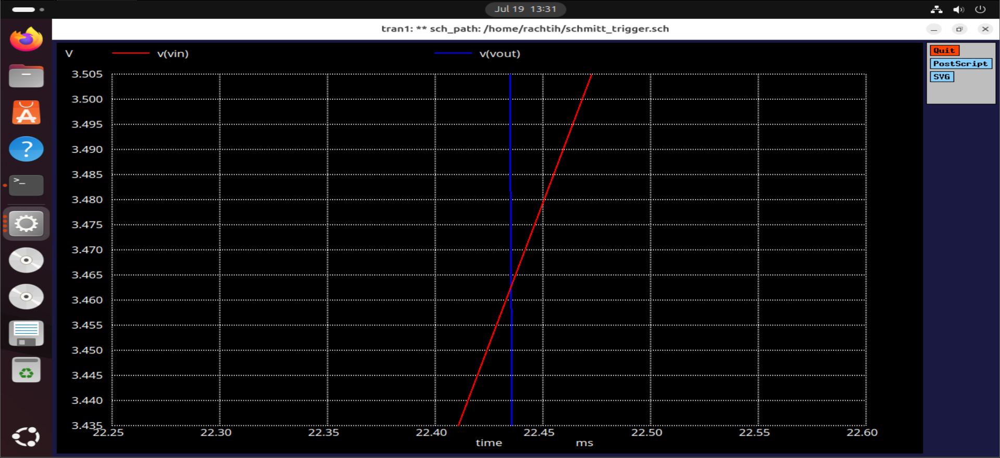
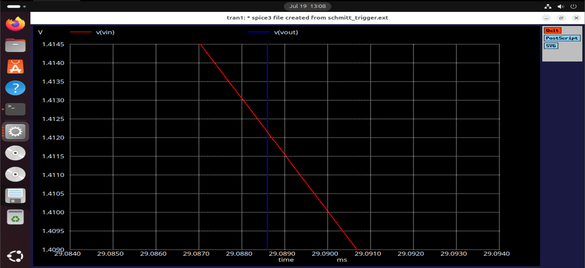

# Inverting Schmitt Trigger using Sky130 PDK
This repository contains the complete design, simulation, and analysis of a Inverting Schmitt Trigger using the Sky130 PDK. It includes all necessary files—schematic, netlist, simulation scripts, layout (in SCMOS), and waveform snapshots—organized for easy understanding and replication.    

  

## Introduction 
This project demonstrates the design and simulation of an inverting CMOS Schmitt Trigger using the Sky130 open-source PDK. The circuit introduces hysteresis by switching its output only when the input crosses distinct high and low thresholds, while also inverting the logic.

Designed in Xschem and simulated with Ngspice, the output transitions from HIGH to LOW at around 66.66% and from LOW to HIGH at around 33.33% of the input sine wave though not precisely at those ideal values. The layout was implemented in Magic using SCMOS layers for simplicity and learning purposes.

The netlist extracted from the SCMOS layout was manually modified to be compatible with Sky130 PDK models, enabling accurate simulation of the layout using Sky130 device definitions.

This project is carried out purely for learning purposes, to explore analog design flow, hysteresis behavior, and basic layout-to-simulation integration using open-source tools. It is not optimized for fabrication or production use.

All essential design files, simulation results, and layout snapshots are included for educational reference and reuse.  

## Tools used  
1. Xschem – Schematic design with SKY130 models
2. Magic VLSI – Layout (SCMOS layers)
3. Sky130 PDK – For model simulation
4. Ngspice – Netlist simulation

## Methodology  
- Installed and configured Xschem, Ngspice, Magic, and the Sky130 PDK. Xschem was set up to use Sky130 symbols and models by linking the correct library paths.
- Designed the Schmitt Trigger schematic in Xschem using Sky130 CMOS transistors. Simulated it in Ngspice with a sine wave input to verify hysteresis behavior.
- Built the layout in Magic using SCMOS layers for simplicity and educational clarity. The goal was to visualize layout structure without focusing on detailed Sky130 implementation.
- Extracted the netlist from Magic and manually updated it by replacing generic nfet/pfet names with Sky130 device names. Included .lib paths to proper model files.
- Simulated the modified layout-extracted netlist in Ngspice and observed correct toggling behavior around 33.33% and 66.66% of the input waveform, confirming functional hysteresis.

## Xschem Schematic and Simulation 

The Schmitt Trigger was designed in Xschem using Sky130 CMOS transistors and simulated with Ngspice. A sine wave input was used to verify hysteresis behavior. The output toggles at approximately 33.33% and 66.66% of the input amplitude.   

**Xschem Images**  

  

  

**Ngspice plots**  
1. Input sine wave 
2. Reference voltage 5V  
3. Digital output 
4. Input-output plot 

**Waveform verification**  

The output toggles at approximately 66.66% and 33.33% of maximum input amplitude.  
For an input sine wave of 5v ,  
- 66.66% of 5v = 3.33v , obtained voltage = 3.4v
- 33.33% of 5v = 1.66v , obtained voltage = 1.1v

   

  

## Magic Layout Implementation (SCMOS)  
The layout was created in Magic using SCMOS layers for simplicity and learning purposes. It helps visualize device placement and connectivity. The extracted netlist was later modified for compatibility with Sky130 simulations.  

    

 
  

## Modifying Extracted Netlist for Sky130  

The netlist extracted from the Magic layout used generic nfet and pfet device names. To make it compatible with Sky130 PDK, these were manually replaced with sky130_fd_pr__nfet_01v8 and sky130_fd_pr__pfet_01v8. Additionally, a .lib statement was added to include the correct Sky130 model file for simulation in Ngspice.  

The following plots were obtained by simulating the modified netlist extracted from the Magic layout, using Sky130-compatible device names and model library references.    
1. Input sine wave 
2. Reference voltage 5V  
3. Digital output 
4. Input-output plot 

**Waveform verification**  

The output toggles at approximately 66.66% and 33.33% of maximum input amplitude.  
For an input sine wave of 5v ,  
- 66.66% of 5v = 3.33v , obtained voltage = 3.34v
- 33.33% of 5v = 1.66v , obtained voltage = 1.41v

   

  

## Conclusion  
This project successfully demonstrates the design and simulation of a CMOS Schmitt Trigger using the Sky130 PDK. The circuit shows expected hysteresis behavior with switching around 33.33% and 66.66% of the input waveform. While the layout was done using SCMOS layers for simplicity, the modified netlist enabled accurate Sky130-based simulation. Overall, the project served as a valuable learning experience in schematic design, layout, and SPICE simulation using open-source tools.

